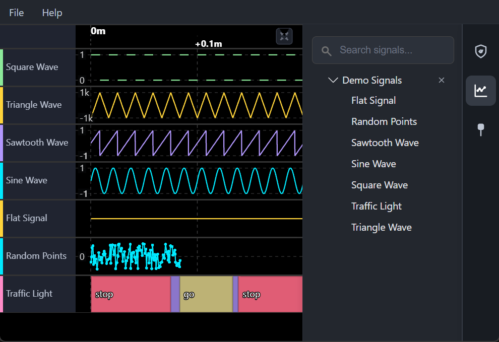

# Voltex

[Voltex](https://app.voltexviewer.com/) is a high-performance waveform viewer built with Electron and WebGL.

## Plugins

Voltex is built on a plugin architecture. Default plugins include CSV/MDF file loaders, waveforms, cursors, and signal management.

Custom plugins can be developed using [@voltex-viewer/plugin-api](https://www.npmjs.com/package/@voltex-viewer/plugin-api). See the [extended demo signals plugin](https://github.com/voltex-viewer/extended-demo-signals-plugin) for an example of a custom plugin.
